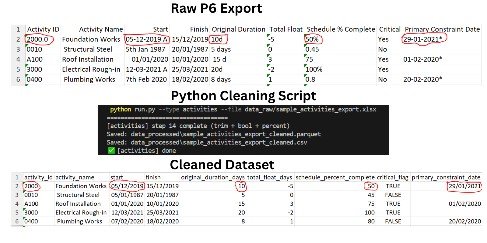

# P6 Export Cleaner

A Python automation tool that cleans and standardizes Primavera P6 Excel exports so they can be used reliably in analytics tools such as Power BI.

This project demonstrates how Python can be used to automate routine data preparation tasks in project controls workflows.

---

## Problem

Primavera P6 schedule exports often contain inconsistent data formats that make analysis difficult.

Examples include:

- Duration values such as `10d` or `5 days`
- Dates with status flags like `05-12-2019 A`
- Constraint dates with asterisks `29-01-2021*`
- Percent complete stored as `50%` instead of numeric values
- Boolean fields stored as text (`Yes/No`)

Before schedule data can be analysed in tools like Power BI or Python analytics pipelines, these inconsistencies must be cleaned and standardized.

---

## Solution

This tool automatically cleans P6 export data by performing several transformations:

- Normalize date formats
- Convert durations to numeric days
- Standardize percent complete values
- Remove constraint flags
- Convert boolean fields to TRUE/FALSE
- Standardize column names
- Produce analytics-ready datasets

The output dataset can then be used directly in:

- Power BI dashboards
- Python analytics pipelines
- Schedule diagnostics tools
- Data engineering workflows

---

## Example Pipeline

Raw Primavera P6 Export  
⬇  
Python Cleaning Script  
⬇  
Cleaned Dataset for Analytics


---

## Example Issues in Raw Export

Typical problems found in P6 exports:

| Raw Value | Issue |
|-----------|------|
| `10d` | Duration unit attached |
| `05-12-2019 A` | Status flag appended |
| `29-01-2021*` | Constraint marker |
| `50%` | Percent stored as text |
| `Yes/No` | Boolean values |

After cleaning:

| Clean Value |
|-------------|
| `10` |
| `05/12/2019` |
| `29/01/2021` |
| `50` |
| `TRUE/FALSE` |

---

## Project Structure

```
p6-export-cleaner
│
├── data_raw
│   Raw Primavera exports
│
├── data_processed
│   Cleaned datasets
│
├── outputs
│   Diagnostics / reports
│
├── docs
│   Project diagrams and images
│
├── src
│   ├── cleaners
│   │   Data cleaning logic
│   │
│   ├── ingest
│   │   Data ingestion and parsing
│   │
│   └── pipelines
│       Cleaning pipelines
│
├── run.py
│   Main execution script
│
├── requirements.txt
│   Python dependencies
│
└── README.md
```


## Installation

Clone the repository:

```bash
git clone https://github.com/gbotosh/p6-export-cleaner.git
cd p6-export-cleaner
```
Create a virtual environment:
```bash
python -m venv venv
```
Activate environment (PowerShell):
```bash
.\venv\Scripts\Activate
```
Install dependencies:
```bash
pip install -r requirements.txt
```
## Usage

Put the Primavera P6 export file (excel format) in the `data_raw` folder.

Run the cleaner on the export:

```bash
python run.py --type activities --file data_raw/sample_activities_export.xlsx
```

The cleaned dataset will be saved in:

```
data_processed/
```

### Technologies Used

Python

Pandas

Excel data processing

Data engineering concepts

### Use Cases

This tool can be used in several project controls workflows:

Preparing P6 exports for Power BI dashboards

Automating schedule data preparation

Feeding schedule data into analytics pipelines

Supporting schedule diagnostics and reporting

### Author

Olaoluwa Gbotoso

Project Controls Professional with experience in:

Primavera P6 scheduling

Project planning and controls

Power BI dashboards

Python automation for project data

### Future Improvements

Planned enhancements include:

Additional cleaning rules

Integration with schedule diagnostics checks

Automated reporting

Power BI integration

Support for Microsoft Project exports